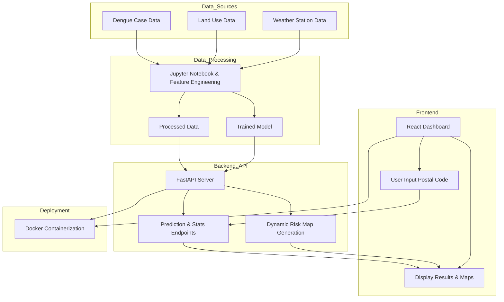

# System Design Diagram: Dengue Outbreak Prediction System


```

**Instructions:**  
- Make sure the code block starts with three backticks and `mermaid` (as above).
- Each node is now on its own line, which resolves the parse error.
- Save and preview in VSCode with the Mermaid extension.

Let me know if you need any more help!